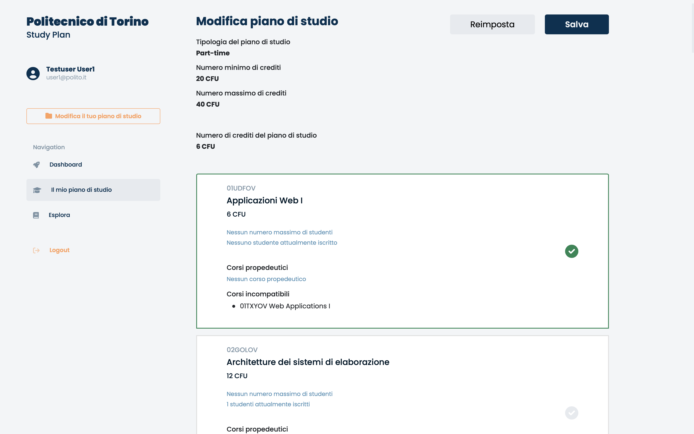

This project has been developed by Andrea Deluca for the course of "Applicazioni Web I", attended during the academic year 2021/22 at Politecnico di Torino, Master's Degree in Computer Engineering.

## Table of Contents

1. [React Client Application Routes](#react-client-application-routes)
   - [Route `/`](#)
   - [Route `/login`](#login)
   - [Route `/explore`](#explore)
   - [Route `/dashboard`](#dashboard)
   - [Route `/study-plan`](#study-plan)
   - [Route `/study-plan/edit`](#study-planedit)
   - [Route `/*`](#1)
2. [API Server](#api-server)
   - [Sessions Routes](#sessions-routes)
     - [`POST /api/sessions/password`](#post-apisessionspassword)
     - [`DELETE /api/sessions/current`](#delete-apisessionscurrent)
     - [`GET /api/sessions/current`](#get-apisessionscurrent)
   - [Courses Routes](#courses-routes)
     - [`GET /api/courses/all`](#get-apicoursesall)
   - [Study Plan Types Routes](#study-plan-types-routes)
     - [`GET /api/study-plans/types`](#get-apistudy-planstypes)
   - [Study Plans Routes](#study-plans-routes)
     - [`GET /api/study-plans`](#get-apistudy-plans)
     - [`POST /api/study-plans`](#post-apistudy-plans)
     - [`PUT /api/study-plans/:id`](#put-apistudy-plansid)
     - [`DELETE /api/study-plans/:id`](#delete-apistudy-plansid)
3. [Database Tables](#database-tables)
   - [Table `users`](#users)
   - [Table `courses`](#courses)
   - [Table `incompatible_courses`](#incompatible_courses)
   - [Table `study_plan_types`](#study_plan_types)
   - [Table `courses_lists`](#courses_lists)
   - [Table `study_plans`](#study_plans)
4. [Main React Components](#main-react-components)
   - [Component `LoginForm`](#loginform)
   - [Component `CourseHeader`](#courseheader)
   - [Component `CourseBody`](#coursebody)
   - [Component `ExpandableCourse`](#expandablecourse)
   - [Component `CoursesList`](#courseslist)
   - [Component `OptionModal`](#optionmodal)
   - [Component `SelectableCourse`](#selectablecourse)
   - [Component `SelectableCoursesList`](#selectablecourseslist)
5. [Screenshot](#screenshot)
6. [Users Credentials](#users-credentials)

## React Client Application Routes

### `/`

_This is the index route_

Homepage for guest users (not logged in users).

_This route is unprotected from the user authentication. Moreover, it is unreachable when the user is logged in._

### `/login`

Page that contains the login form to perform authentication.

_This route is unprotected from the user authentication. Moreover, it is unreachable when the user is logged in._

### `/explore`

Page that contains the list of all courses offered

_This route is unprotected from the user authentication._

### `/dashboard`

Homepage for authenticated and logged in users.

_This route is protected. The user must be authenticated to navigate here._

### `/study-plan`

Page that contains info about the study plan associated with the logged in user and its correlated list of courses, if they exist.

_This route is protected. The user must be authenticated to navigate here._

### `/study-plan/edit`

Page where the logged in user can edit the list of courses associated with its study-plan, if they exist.

_This route is protected. The user must be authenticated to navigate here._

### `/*`

Any other route is matched by this one where the application shows a page not found error.

## API Server

### **Sessions Routes**

#### `POST /api/sessions/password`

Performs user authentication and create a new session for the user.

**Request header:**

`Content-Type: application/json`

**Request body:**

A JSON object containing username and password.

```json
{
	"username": "user1@polito.it",
	"password": "Password123*"
}
```

**Response body**

`HTTP status code 200 OK`

```json
{
	"id": 1,
	"firstname": "Testuser",
	"lastname": "User1",
	"email": "user1@polito.it"
}
```

**Error responses**

- `HTTP status code 500 Internal Server Error` (generic server error)
- `HTTP status code 401 Unauthorized` (credentials error)

#### `DELETE /api/sessions/current`

Performs user logout and delete the current user session.

**Request header:**

`Session: req.user to retrieve the logged in user id`

**Response body**

`HTTP status code 200 OK`

**Error responses**

- `HTTP status code 500 Internal Server Error` (generic server error)

#### `GET /api/sessions/current`

Gets information about the user, if he is logged in.

**Request header:**

`Session: req.user to retrieve the logged in user id`

**Response body**

`HTTP status code 200 OK`

```json
{
	"id": 1,
	"firstname": "Testuser",
	"lastname": "User1",
	"email": "user1@polito.it"
}
```

**Error responses**

- `HTTP status code 500 Internal Server Error` (generic server error)
- `HTTP status code 404 Not Found` (user not found error)
- `HTTP status code 401 Unauthorized` (authentication error)

### **Courses Routes**

#### `GET /api/courses/all`

Gets information about courses offered, including incompatibilities info, ordered by name.

**Response body**

`HTTP status code 200 OK`

Here some examples of course objects returned as response body, with and not preparatory course, incompatible courses and maximum number of enrolled students.

```json
[
  {
      "code": "01UDFOV",
      "name": "Applicazioni Web I",
      "credits": 6,
      "maxStudents": null,
      "enrolledStudents": 0,
      "preparatoryCourse": null,
      "incompatibleCourses": [
          {
              "code": "01TXYOV",
              "name": "Web Applications I"
          }
      ]
  },
  {
      "code": "02GOLOV",
      "name": "Architetture dei sistemi di elaborazione",
      "credits": 12,
      "maxStudents": null,
      "enrolledStudents": 0,
      "preparatoryCourse": null,
      "incompatibleCourses": [
          {
              "code": "02LSEOV",
              "name": "Computer architectures"
          }
      ]
  },
  {
      "code": "03UEWOV",
      "name": "Challenge",
      "credits": 5,
      "maxStudents": null,
      "enrolledStudents": 0,
      "preparatoryCourse": null
  },

  ...

  {
      "code": "05BIDOV",
      "name": "Ingegneria del software",
      "credits": 6,
      "maxStudents": null,
      "enrolledStudents": 0,
      "preparatoryCourse": {
          "code": "02GOLOV",
          "name": "Architetture dei sistemi di elaborazione"
      },
      "incompatibleCourses": [
          {
              "code": "04GSPOV",
              "name": "Software engineering"
          }
      ]
  },
  {
    "code": "01URSPD",
    "name": "Internet Video Streaming",
    "credits": 6,
    "maxStudents": 2,
    "enrolledStudents": 0,
    "preparatoryCourse": null
  },

  ...

]
```

**Error responses**

- `HTTP status code 500 Internal Server Error` (generic server error)
- `HTTP status code 404 Not Found` (courses not found error)

### **Study Plan Types Routes**

#### `GET /api/study-plans/types`

Gets information about types that a study plan can take.

**Request header:**

`Session: req.user to retrieve the logged in user id`

**Response body**

`HTTP status code 200 OK`

```json
[
	{
		"id": 1,
		"name": "Full-time",
		"min_credits": 60,
		"max_credits": 80
	},
	{
		"id": 2,
		"name": "Part-time",
		"min_credits": 20,
		"max_credits": 40
	}
]
```

**Error responses**

- `HTTP status code 500 Internal Server Error` (generic server error)
- `HTTP status code 404 Not Found` (study plan types not found error)
- `HTTP status code 401 Unauthorized` (authentication error)

### **Study Plans Routes**

#### `GET /api/study-plans`

Gets information about the study plan associated with the logged in user, including info about the list of courses correlated to it and info about the study plan type.

**Request header:**

`Session: req.user to retrieve the logged in user id`

**Response body**

`HTTP status code 200 OK`

```json
{
	"id": 2,
	"totCredits": 23,
	"type": {
		"id": 2,
		"name": "Part-time",
		"min": 20,
		"max": 40
	},
	"createDate": "2022-06-21T18:44:00.837Z",
	"updateDate": "2022-06-21T18:44:07.302Z",
	"courses": ["01UDFOV", "02GOLOV", "03UEWOV"]
}
```

**Error responses**

- `HTTP status code 500 Internal Server Error` (generic server error)
- `HTTP status code 404 Not Found` (study plan not found error)
- `HTTP status code 401 Unauthorized` (authentication error)

#### `POST /api/study-plans`

Creates a new study plan entry, that has to be associated with the logged in user, and fills its correlated list of courses.
It also updates the number of enrolled students for the courses inserted into the study plan.

**Request header:**

`Content-Type: application/json`

`Session: req.user to retrieve the logged in user id`

**Request body:**

A JSON object containing info about the study plan and a list of courses to insert into the correlated list.

```json
{
	"updates": {
		"inserts": ["01UDFOV", "02GOLOV", "03UEWOV"],
		"deletes": []
	},
	"plan": {
		"type": 2,
		"credits": 23,
		"createDate": "2022-06-21T09:19:11.091Z",
		"updateDate": "2022-06-21T09:25:03.091Z"
	}
}
```

**Response body**

`HTTP status code 200 OK`

**Error responses**

- `HTTP status code 500 Internal Server Error` (generic server error)
- `HTTP status code 422 Unprocessable Entity` (validation error)
- `HTTP status code 401 Unauthorized` (authentication error)

#### `PUT /api/study-plans/:id`

Updates info about the study plan associated with the logged in user and the list of courses correlated to it, given the study plan id.
It also updates the number of enrolled students for the courses inserted and removed from the study plan.

**Request header:**

`Content-Type: application/json`

`Session: req.user to retrieve the logged in user id`

`Params: req.params.id to retrieve study plan id`

**Request body:**

A JSON object containing info about the updates for the study plan.

```json
{
	"updates": {
		"inserts": ["01SQMOV", "01UDUOV"],
		"deletes": ["03UEWOV"]
	},
	"plan": {
		"type": 2,
		"credits": 38,
		"updateDate": "2022-06-23T11:28:03.091Z"
	}
}
```

**Response body**

`HTTP status code 200 OK`

**Error responses**

- `HTTP status code 500 Internal Server Error` (generic server error)
- `HTTP status code 422 Unprocessable Entity` (validation error)
- `HTTP status code 404 Not Found` (study plan not found error)
- `HTTP status code 401 Unauthorized` (authentication error)

#### `DELETE /api/study-plans/:id`

Deletes the study plan associated with the logged in user and the list of courses correlated to it, given the study plan id.
It also updates the number of enrolled students for the courses removed from the study plan.

**Request header:**

`Session: req.user to retrieve the logged in user id`

`Params: req.params.id to retrieve study plan id`

**Response body**

`HTTP status code 200 OK`

**Error responses**

- `HTTP status code 500 Internal Server Error` (generic server error)
- `HTTP status code 422 Unprocessable Entity` (validation error)
- `HTTP status code 404 Not Found` (study plan not found error)
- `HTTP status code 401 Unauthorized` (authentication error)

## Database Tables

### `users`

It contains info about users, including authentication info.

```
id (PRIMARY KEY)
firstname
lastname
email (UNIQUE NOT NULL) - used as username during authentication
password
salt
```

### `courses`

It contains info about courses offered, including propedeuticity info.

```
id (PRIMARY KEY)
code (UNIQUE NOT NULL)
name
credits
max_students - it can be null
enrolled_students
preparatory_course (FOREIGN KEY REFERENCES courses(code)) - it can be null
```

### `incompatible_courses`

It contains info about incompatible courses.

```
id (PRIMARY KEY)
course_code (FOREIGN KEY REFERENCES courses(code))
incompatible_course (FOREIGN KEY REFERENCES courses(code))
```

### `study_plan_types`

It contains info about types that a study plan can take, i.e. Full-time or Part-time.

```
id (PRIMARY KEY)
name
min_credits
max_credits
```

### `courses_lists`

It contains info about the list of courses associated with a study plan.

```
id (PRIMARY KEY)
course_code (FOREIGN KEY REFERENCES courses(code))
```

### `study_plans`

It contains info about study plans.

```
id (PRIMARY KEY)
user_id (FOREIGN KEY REFERENCES users(id))
list_id (FOREIGN KEY REFERENCES courses_lists(id))
type_id (FOREIGN KEY REFERENCES study_plan_types(id))
tot_credits
create_timestamp
last_update_timestamp
```

## Main React Components

### `LoginForm`

`components/forms/LoginForm.jsx`

This component contains the login form that calls the correlated API on submit.

### `CourseHeader`

`components/ui-core/Course.jsx`

This component shows the main info about a course. In particular, it shows the course code, its name, its number of credits, its maximum number of enrolled students, if exists, and the number of enrolled students at the moment.

### `CourseBody`

`components/ui-core/Course.jsx`

This component shows the propedeuticity and incompatibility info about a course.

### `ExpandableCourse`

`components/ui-core/CoursesList.jsx`

This component is a wrapper for the visualization of all course info in an expandable way. In particulr, if it's closed, the component shows just the CourseHeader component, else if it'open, also CourseBody component is shown.

### `CoursesList`

`components/ui-core/CoursesList.jsx`

This component shows a list of ExpandableCourse components, given the array of courses to show.

### `OptionModal`

`components/ui-core/OptionModal.jsx`

When this modal is triggered, it shows info about the study plan types and it allows the user to choose one option to create its study plan locally, without any saving in db.

### `SelectableCourse`

`components/ui-core/SelectableCoursesList.jsx`

This component shows all info about a course, i.e. CourseHeader and CourseBody components, and draws a green border when a course results selected. Moreover, it also can show a course as disabled.

### `SelectableCoursesList`

`components/ui-core/SelectableCoursesList.jsx`

It contains the logic on client-side of the update of a study plan and its correlated list of courses.

This component shows two lists of SelectableCourse components to show the list of courses already inserted into the study plan associated with a user and the list of courses not selected, possibly disabled.
Moreover, it checks for study plan courses constraints when a course is selected or deselected.

### `Plan`

`pages/Plan.jsx`

This component shows info about the study plan associated with the logged in user and the list of courses correlated, if they exist. Morover, it contains client-side logic to delete the stuy plan.

### `EditPlan`

`pages/EditPlan.jsx`

This component allows the logged in user to edit his study plan and its correlated list of courses, if they exist. Morover, it contains the client-side logic to perform the creation or the update of the study plan on submit.

## Screenshot



## Users Credentials

| id  | firstname | lastname | email           | password      | study plan |
| :-- | :-------- | :------- | :-------------- | :------------ | ---------- |
| 1   | Testuser  | User1    | user1@polito.it | Password123\* | Full-time  |
| 2   | Testuser  | User2    | user2@polito.it | Password123\* | Part-time  |
| 3   | Testuser  | User3    | user3@polito.it | Password123\* | Part-time  |
| 4   | Testuser  | User4    | user4@polito.it | Password123\* |
| 5   | Testuser  | User5    | user5@polito.it | Password123\* |
